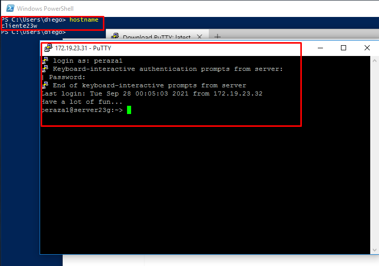
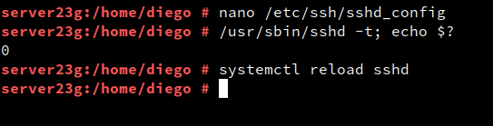

# **Acceso Remto SSH**

## **1. Preparativos**

#### **1.1 Servidor SSH**


- Añadiremos en ``/etc/hosts`` los siguientes equipos:


- Haremos ping en los dos equipos cliente desde el servidor.


- Crearemos los siguientes usuarios con su carpeta home ``useradd -m perazaX`` en server23g:


#### **1.2 Cliente GNU/Linux**


- Añadiremos en ``/etc/hosts`` los siguientes equipos:


- Comprobamos haciendo ping a ambos equipos:


#### **1.3 Cliente Windows**

- Instalaremos el software PuTTY:


- Configuramos el cliente:


- Añadiremos en `` C:\Windows\System32\drivers\etc\hosts`` los siguientes equipos:


- Comprobamos haciendo ping a ambos equipos:


## **2. Instalación del servicio SSH en GNU/Linux**

- Instalaremos el servicio SSH en el server23g por comandos : ``zypper install openssh``

- Verificamos que el servicio está en ejecución:


- Comprobamos que el servicio está escuchando por el puerto 22:


### **2.1 Primera conexión SSH desde cliente GNU/Linux**

- Iremos al cliente23g, comprobaremos la conectividad con el servidor, y comprobar los puertos abiertos en el servidor.


- Desde el cliente GNU/Linux nos conectamos mediante ``ssh peraza1@server23g``


- A partir de ahora cuando nos conectamos sólo nos pide la contraseña:


- Comprobamos contenido del fichero ``$HOME/.ssh/known_hosts``en el equipo cliente.


### **2.2 Primera conexión SSH desde cliente Windows**





## **3. Cambiamos la identidad del servidor**

- Comprobamos que existen los ficheros ``ssh_host*key`` y ``ssh_host*key.pub``en el directorio ``/etc/shh``


- Modificaremos el fichero de configuración SSH para dejar una única línea:


### **3.1 Regenerar certificados**

- Vamos a combiar o volver a generar nuevas claves públicas/privadas que identifican nuestro servidor.


- Reiniciar el servicio SSH y comprobarlo.


### **3.2 Comprobamos**

- Comprobar qué sucede al volver a conectarnos desde los dos clientes, usando los usuarios peraza2 y peraza1. ¿Qué sucede?


- Lo que sucede es que aparece la misma clave.

## **4. Personalización del prompt Bash**

- Configuraremos el fichero ``/home/peraza1/.bashrc`` en la máquina servidor.


- Además, crearemos el fichero `` /home/1er-apellido-alumno1/.alias``, donde pondremos el siguiente contenido:


- Comprobaremos el funcionamiento de la conexión SSH desde cada cliente.

**Windows**


**Linux**


## **5. Autenticación mediante claves públicas**

- Generamos un nuevo par de claves.


- Ahora vamos a copiar la clave pública


- Comprobamos que la clave que acabamos de copiar se haya copiado correctamente.


- Comprobaremos en los clientes que ahora al accedes por SSH al usuario `peraza4`:

  - `cliente23g`, NO se pide password.

  - `cliente23w`, SI se pide password.


## **6. Uso de SSH como túnel para X**

- En el servidor instalaremos una aplicación de entorno gráfico (APP1), en este caso instalaremos **Geany**.


- Modificaremos el fichero de configuración del servidor SSH GNU/Linux,para permitir la ejecución de aplicaciones gráficas, desde los clientes.


- Reiniciaremos el servicio ``sshd``


- Vamos al cliente y comprobamos que no está instalado el programa APP1.


- Nos conectamos de forma remota al servidor, y ahora ejecutamos APP1 de forma remota.


## **7. Aplicaciones Windows nativas**

- Instalaremos el emulador Wine en el `server23g`.


- Comprobamos el funcionamiento de APP2 en `server23g` y accediendo dede `cliente23g`.


## **8. Restricciones de uso**

### **8.1 Restricción sobre un usuario**

- Modificaremos el fichero de configuración del servidor SSH GNU/Linux para restringir el acceso a determinados usuarios.




- Comprobamos la restricción al acceder desde los clientes

  - ``cliente23g``


  - ``cliente23w``
  

### **8.2 Restricción sobre una aplicación**

- Crearemos el grupo remoteapps ,y dentro incluiremos al usuario ``peraza4``


- Localizamos el programa APP1 y vemos que tiene permisos 755.


- Cambiamos el grupo propietario a remoteapps , y pondremos los permisos del programa APP1 a 750.


- Comprobamos el funcionamiento en el servidor local y desde el cliente23g en remoto.


## **9. Servidor SSH en Windows**

- Añadir en ``C:\Windows\System32\drivers\etc\hosts`` el equipo ``cliente23g`` y ``cliente23w``.


- Comprobamos haciendo ping a ambos equipos


### **9.1 Instalación y configuración del servidor SSH en Windows**

- Descargaremos la última versión de OpenSSH.


- Descomprimir en ``C:\Program Files\OpenSSH``


- Iniciaremos PowerShell como Administrador y nos movemos hasta ``C:\Program Files\OpenSSH``.

- Ejecutamos los siguientes comandos para instalar los servicios `sshd` y `ssh-agent`:

```
PS> Set-ExecutionPolicy –ExecutionPolicy Bypass
PS> .\install-sshd.ps1
```


- Al terminar debe indicar que los servicios se han instalado de forma satisfactoria. Podemos comprobar que se han
instalado los servicios con el siguiente comando: `PS> Get-Service sshd,ssh-agent`


- Generamos las claves del servidor:


- Habilitamos una regla en el Firewall de Windows, que permita las conexiones TCP entrantes en el puerto 22 (SSH). Además iniciaremos el servicio ``sshd``.


- Comprobamos.


### **9.2 Comprobar acceso SSH de los Clientes Windows y GNU/Linux en el servidor SSH Windows**

- Windows (cliente23w)


- GNU/Linux (cliente23g)


