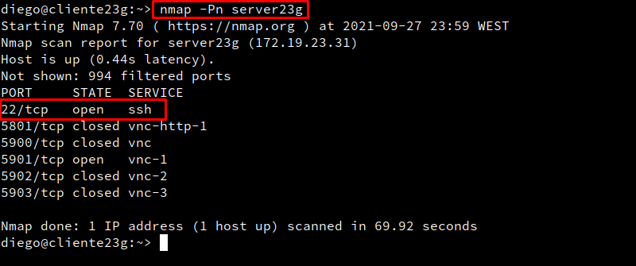
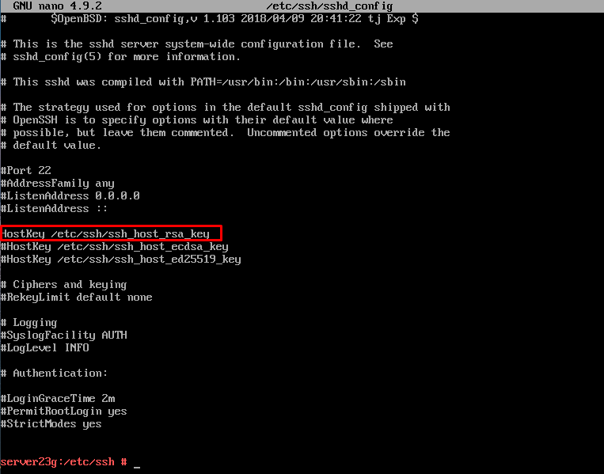

# **Acceso Remto SSH**

## **1. Preparativos**

#### **1.1 Servidor SSH**

- Añadiremos en ``/etc/hosts`` los siguientes equipos:

- Haremos ping en los dos equipos cliente desde el servidor.

- Crearemos los siguientes usuarios con su carpeta home ``useradd -m perazaX`` en server23g:

#### **1.2 Cliente GNU/Linux**

- Añadiremos en ``/etc/hosts`` los siguientes equipos:

- Comprobamos haciendo ping a ambos equipos:

#### **1.3 Cliente Windows**

- Instalaremos el software PuTTY:

- Configuramos el cliente:

- Añadiremos en `` C:\Windows\System32\drivers\etc\hosts`` los siguientes equipos:

- Comprobamos haciendo ping a ambos equipos:

## **2. Instalación del servicio SSH en GNU/Linux**

- Instalaremos el servicio SSH en el server23g por comandos : ``zypper install openssh``

- Verificamos que el servicio está en ejecución:

- Comprobamos que el servicio está escuchando por el puerto 22:

### **2.1 Primera conexión SSH desde cliente GNU/Linux**

- Iremos al cliente23g, comprobaremos la conectividad con el servidor, y comprobar los puertos abiertos en el servidor.

- Desde el cliente GNU/Linux nos conectamos mediante ``ssh peraza1@server23g``

- A partir de ahora cuando nos conectamos sólo nos pide la contraseña:

- Comprobamos contenido del fichero ``$HOME/.ssh/known_hosts``en el equipo cliente.

### **2.2 Primera conexión SSH desde cliente Windows**

## **3. Cambiamos la identidad del servidor**

- Comprobamos que existen los ficheros ``ssh_host*key`` y ``ssh_host*key.pub``en el directorio ``/etc/shh``

- Modificaremos el fichero de configuración SSH para dejar una única línea:

### **3.1 Regenerar certificados**

- Vamos a combiar o volver a generar nuevas claves públicas/privadas que identifican nuestro servidor.

- Reiniciar el servicio SSH y comprobarlo.

### **3.2 Comprobamos**

- Comprobar qué sucede al volver a conectarnos desde los dos clientes, usando los usuarios peraza2 y peraza1. ¿Qué sucede?

- Lo que sucede es que aparece la misma key privada.

## **4. Personalización del prompt Bash**

- Configuraremos el fichero ``/home/peraza1/.bashrc``en la máquina servidor.

- Además, crearemos el fichero `` /home/1er-apellido-alumno1/.alias``, donde pondremos el siguiente contenido:

- Comprobaremos el funcionamiento de la conexión SSH desde cada cliente.

**Windows**

**Linux**

## **5. Autenticación mediante claves públicas**

## **6. Uso de SSH como túnel para X**
