# **P1:Acceso Remoto VNC**

## **1. Windows: Slave VNC**

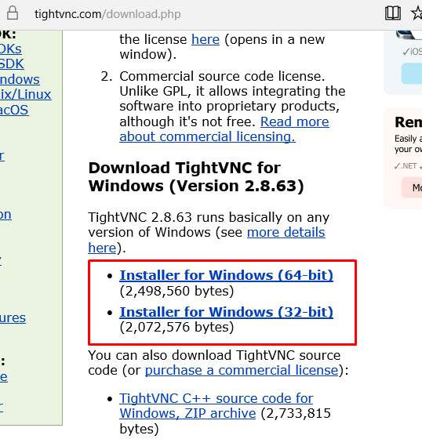

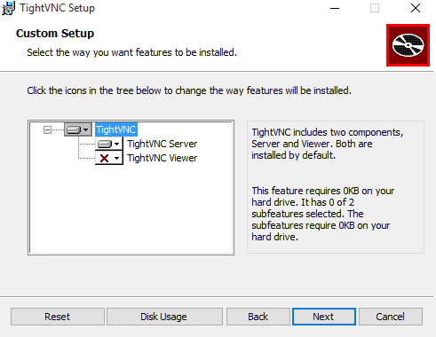
## **2. Windows: Master VNC**

#### **2.1 Comprobaciones finales de Windows**

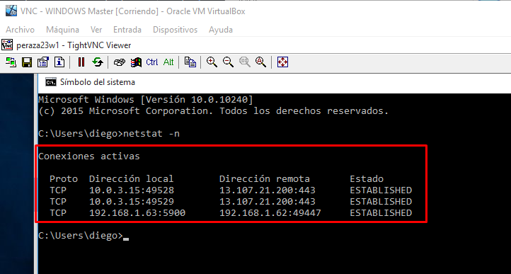

## **3. OpenSUSE: Slave VNC**

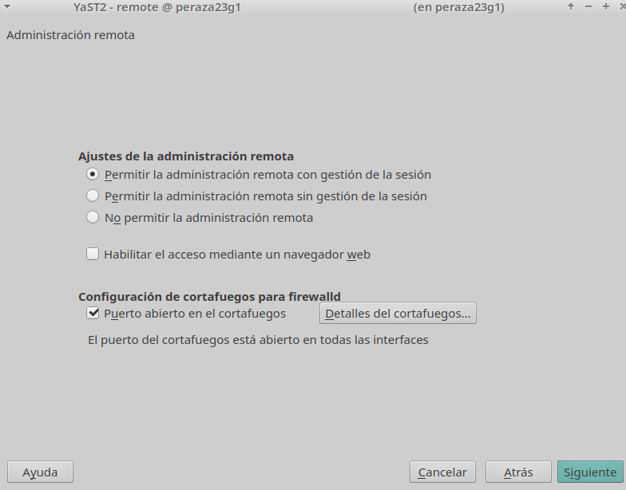

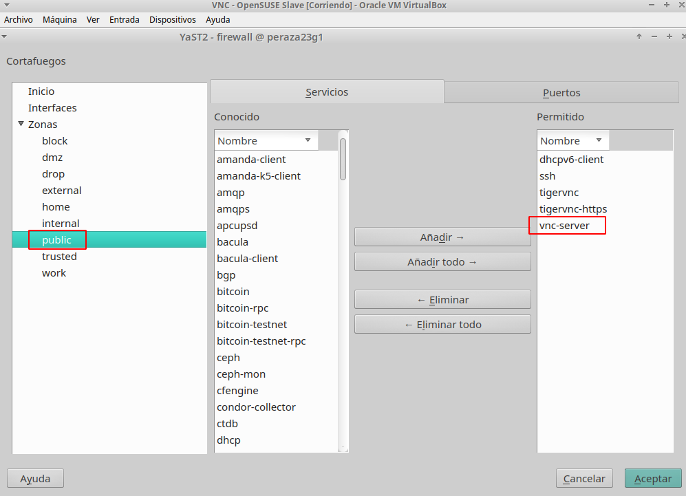

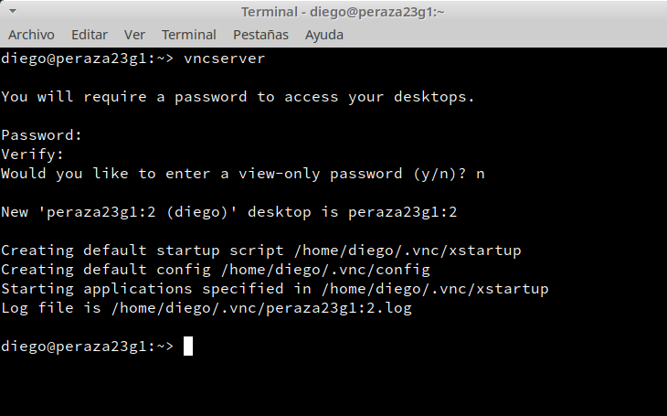

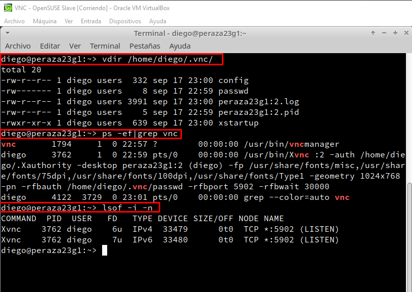

#### **3.1 Ir a una MV GNU/Linux**

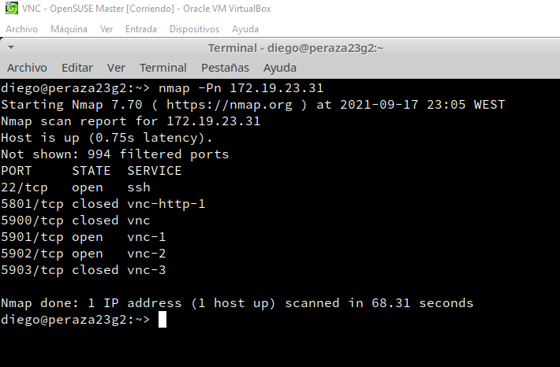

## **4. OpenSUSE: Master VNC**

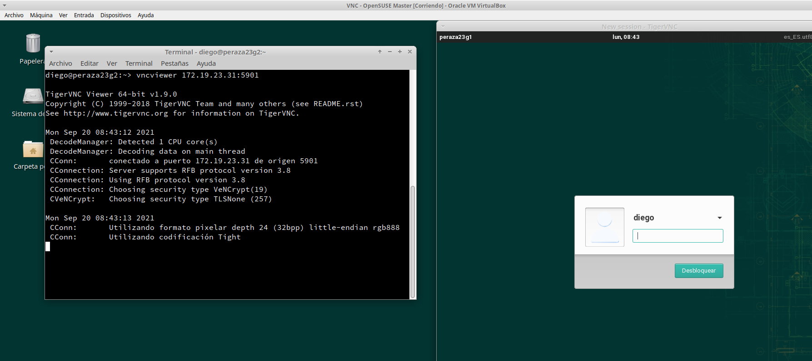

#### **4.1 Comprobaciones finales de OpenSUSE**

## **5. Comprobaciones con SSOO cruzados**

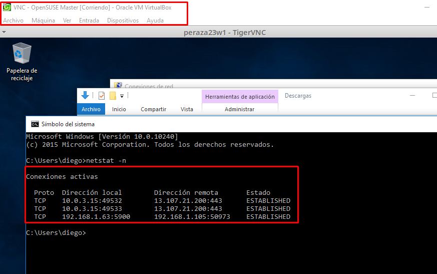

## **6. Display 0 en GNU/Linux**

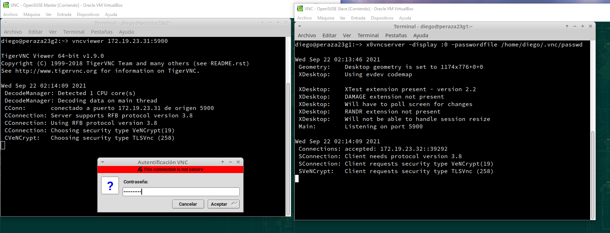
