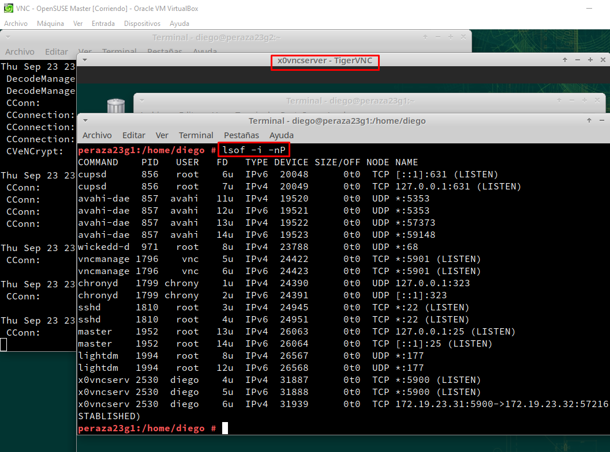

# **P1:Acceso Remoto VNC**

## **0. Configuraciones de red previas**

- **En clase**

| Rol | OS | Ip |
| ----------- | ----------- |----------- |
| Slave VNC | OpenSUSE | 172.19.23.31 |
| Master VNC | OpenSUSE | 172.19.23.32 |
| Slave VNC | Windows | 172.19.23.11 |
| Master VNC | Windows | 172.19.23.12 |

- **En casa**

| Rol | OS | Ip |
| ----------- | ----------- |----------- |
| Slave VNC | OpenSUSE | 172.19.23.31 |
| Master VNC | OpenSUSE | 172.19.23.32 |
| Slave VNC | Windows | 192.168.1.63 |
| Master VNC | Windows | 192.168.1.62 |

## **1. Windows: Slave VNC**

#### **1.1 Ir a una MV GNU/Linux**

## **2. Windows: Master VNC**

#### **2.1 Comprobaciones finales de Windows**

## **3. OpenSUSE: Slave VNC**

#### **3.1 Ir a una MV GNU/Linux**

## **4. OpenSUSE: Master VNC**

#### **4.1 Comprobaciones finales de OpenSUSE**

## **5. Comprobaciones con SSOO cruzados**

- **OpenSUSE Master / Windows Slave**

- **OpenSUSE Master / Windows Slave**

## **6. Display 0 en GNU/Linux**

