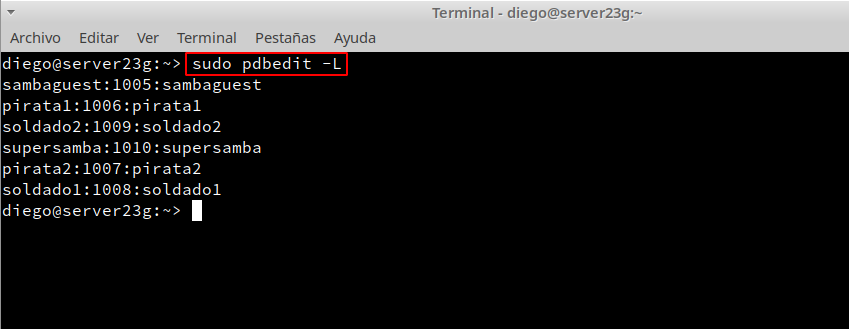
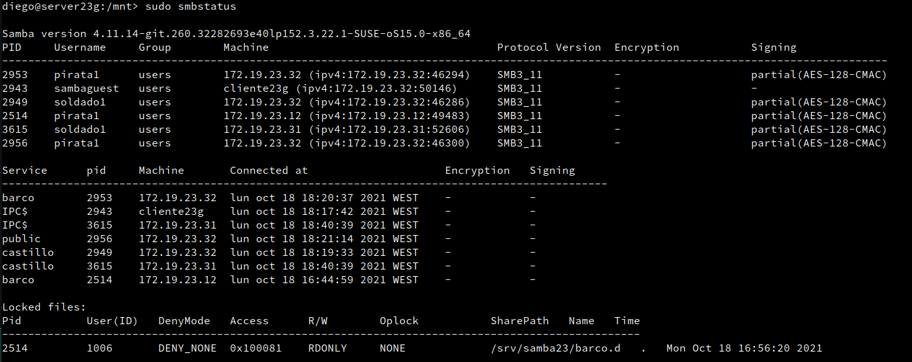

# **P1: Recursos SMB/CIFS**

### **0. Introducción**

Vamos a necesitar las siguientes máquinas:

| ID  | Función  | SSOO     | IP estática  | Hostname  |
| --- | -------- | -------- | ------------ | --------- |
| MV1 | Servidor | OpenSUSE | 172.19.23.31 | server23g |
| MV2 | Cliente  | OpenSUSE | 172.19.23.32 | client23g |
| MV3 | Cliente  | Windows  | 172.19.23.12 | client23w |

### **1. Servidor Samba**

#### **1.1 Preparativos**

#### **1.2 Usuarios locales**

#### **1.3 Crearemos las carpetas para los futuros recursos compartidos**

* Vamos a crear las carpetas para los recursos compartidos de la siguiente forma:

| Recurso  | Directorio              | Usuario    | Grupo      | Permisos |
| -------- | ----------------------- | ---------- | ---------- | -------- |
| public   | /srv/samba23/public.d   | supersamba | sambausers | 770 |
| castillo | /srv/samba23/castillo.d | supersamba | soldados   | 770 |
| barco    | /srv/samba23/barco.d    | supersamba | piratas    | 770 |

#### **1.4 Configurar el servidor Samba**

- Reiniciamos la MV y comrpobamos:

#### **1.5 Crear los recursos compartidos de red**

#### **1.6 Usuarios Samba**

#### **1.7 Reiniciar**

### **2. Windows**

#### **2.1 Cliente Windows GUI**

#### **2.2 Cliente Windows comandos**

### **3. Cliente GNU/Linux**

#### **3.1 Cliente GNU/Linux GUI**

#### **3.2 Cliente GNU/Linux comandos**

#### **3.3 Montaje automático**

