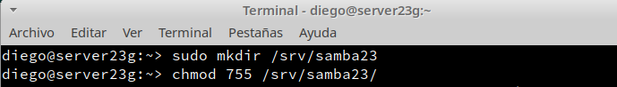
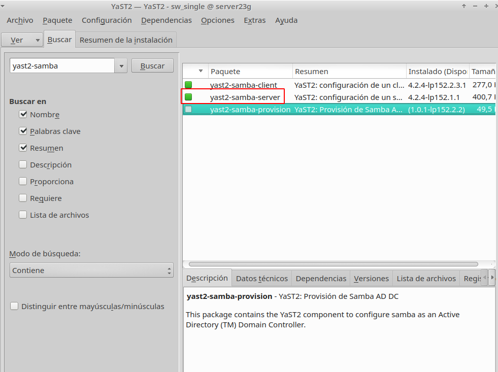
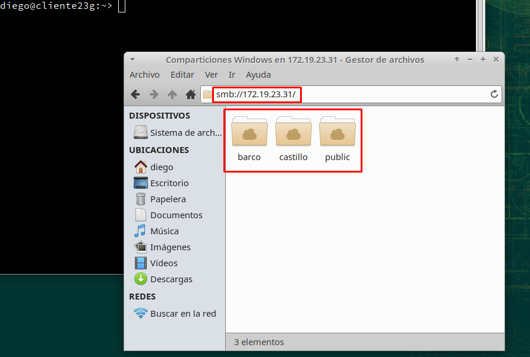
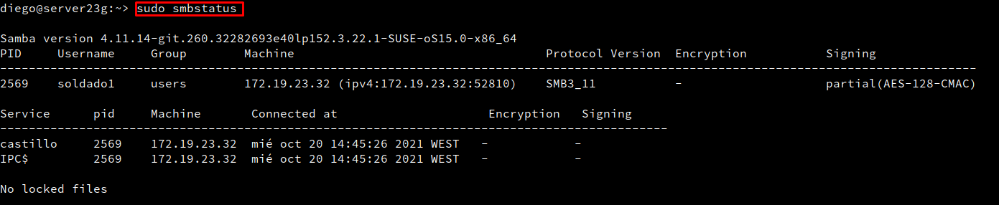

# **P1: Recursos SMB/CIFS**

### **0. Introducción**

Vamos a necesitar las siguientes máquinas:

| ID  | Función  | SSOO     | IP estática  | Hostname  |
| --- | -------- | -------- | ------------ | --------- |
| MV1 | Servidor | OpenSUSE | 172.19.23.31 | server23g |
| MV2 | Cliente  | OpenSUSE | 172.19.23.32 | client23g |
| MV3 | Cliente  | Windows  | 172.19.23.12 | client23w |

### **1. Servidor Samba**

#### **1.1 Preparativos**

- Configuración de red


- Fichero /etc/hosts


#### **1.2 Usuarios locales**
- Crearemos los siguientes grupos


- Editamos el fichero `/etc/passwd` , modificaremos el usuario sambaguest y le ponemos como shell `/bin/false`


- Creamos los siguientes usuarios:


-  Dentro del grupo `piratas` incluir a los usuarios `pirata1`, `pirata2` y `supersamba`.
* Dentro del grupo `soldados` incluir a los usuarios `soldado1` y `soldado2` y `supersamba`.
* Dentro del grupo `sambausers`, poner a todos los usuarios `soldados`, `piratas`, `supersamba` y a `sambaguest`.


#### **1.3 Crearemos las carpetas para los futuros recursos compartidos**




* Vamos a crear las carpetas para los recursos compartidos de la siguiente forma:

| Recurso  | Directorio              | Usuario    | Grupo      | Permisos |
| -------- | ----------------------- | ---------- | ---------- | -------- |
| public   | /srv/samba23/public.d   | supersamba | sambausers | 770 |
| castillo | /srv/samba23/castillo.d | supersamba | soldados   | 770 |
| barco    | /srv/samba23/barco.d    | supersamba | piratas    | 770 |


#### **1.4 Configurar el servidor Samba**

- Comprobamos por yast de que el paquete ya viene instalado.



- Hacemos una copia de seguridad del fichero de configuración antes de modificarlo.


- Reiniciamos la MV y comprobamos que los puertos 139 y 445 están abiertos:


#### **1.5 Crear los recursos compartidos de red**


- Verificamos la sintaxis.


- Consultamos el contenido del fichero de configuración.


#### **1.6 Usuarios Samba**

- Después de crear los usuarios en el sistema, tenemos que añadirlos a Samba.

- `smbpasswd -a USUARIO`, para crear clave Samba de USUARIO.


- Comprobamos la lista de usuarios de Samba.


#### **1.7 Reiniciar**

- Comprobamos de que el servidor SMB/CIF está a la escucha.


### **2. Windows**


- Configuramos el fichero ``c:\Windows\System32\drivers\etc\hosts``


- Comprobamos de que en los clientes Windows, el software necesario ya viene preinstalado.


#### **2.1 Cliente Windows GUI**

- Escribimos ``//172.19.23.31`` y vemos lo siguiente:


- Accederemos al recurso compartido ``public``.


- Accederemos al recurso compartido ``castillo`` con el usuario ``soldado1``.


- Veremos las conexiones abiertas en la Powershell y después borramos todas las conexión SMB/CIFS que se hayan realizado.


- Accederemos al recurso compartido ``barco`` con el usuario ``pirata1``.


- Nos vamos al servidor Samba y comprobamos los resultados de los siguientes comandos:


#### **2.2 Cliente Windows comandos**

- Vemos que no hay conexiones establecidas y también los recursos del servidor remoto.


- Montaremos el recurso barco de forma persistente. Para ello lo primero será crear una conexión con el recurso compartido y lo montaráen la unidad S.


- Nos vamos al servidor Samba y comprobamos los resultados de los siguientes comandos:


### **3. Cliente GNU/Linux**


- Configuramos el fichero ``/etc/hosts``


#### **3.1 Cliente GNU/Linux GUI**

- Accedemos al recurso compartido del servidor de Samba.



- Probamos a acceder y crear carpetas/archivos en ``castillo`` y en ``barco``.


- Comprobamos que el recurso `public` es de sólo lectura.


- Nos vamos al servidor Samba y comprobamos los resultados de los siguientes comandos:


#### **3.2 Cliente GNU/Linux comandos**

- Probar desde el cliente GNU/Linux el comando ``smbclient --list 172.19.23.31``, que muestra los recursos SMB/CIFS del servidor remoto.


- Ahora creamos en local la carpeta ``/mnt/remoto23/castillo``


- Montamos el recurso compartido y comprobamos que el recurso ha sido montado correctamente.


- Nos vamos al servidor Samba y comprobamos los resultados de los siguientes comandos:




#### **3.3 Montaje automático**

- Reiniciamos la MV y vemos que los recursos ya no están montados, porque el montaje fue temporal.


- Ahora modificaremos el fichero /etc/fstab e incluimos la siguiente línea.


```
UUID=b3dcc92d-73ac-4b50-a96d-6c2568b087ee  /                       btrfs  defaults                      0  0
UUID=b3dcc92d-73ac-4b50-a96d-6c2568b087ee  /var                    btrfs  subvol=/@/var                 0  0
UUID=b3dcc92d-73ac-4b50-a96d-6c2568b087ee  /usr/local              btrfs  subvol=/@/usr/local           0  0
UUID=b3dcc92d-73ac-4b50-a96d-6c2568b087ee  /tmp                    btrfs  subvol=/@/tmp                 0  0
UUID=b3dcc92d-73ac-4b50-a96d-6c2568b087ee  /srv                    btrfs  subvol=/@/srv                 0  0
UUID=b3dcc92d-73ac-4b50-a96d-6c2568b087ee  /root                   btrfs  subvol=/@/root                0  0
UUID=b3dcc92d-73ac-4b50-a96d-6c2568b087ee  /opt                    btrfs  subvol=/@/opt                 0  0
UUID=b3dcc92d-73ac-4b50-a96d-6c2568b087ee  /home                   btrfs  subvol=/@/home                0  0
UUID=b3dcc92d-73ac-4b50-a96d-6c2568b087ee  /boot/grub2/x86_64-efi  btrfs  subvol=/@/boot/grub2/x86_64-efi  0  0
UUID=b3dcc92d-73ac-4b50-a96d-6c2568b087ee  /boot/grub2/i386-pc     btrfs  subvol=/@/boot/grub2/i386-pc  0  0
UUID=b3dcc92d-73ac-4b50-a96d-6c2568b087ee  /.snapshots             btrfs  subvol=/@/.snapshots          0  0
UUID=ef98bdad-be2c-4a7f-b4af-a61178b29238  swap                    swap   defaults                      0  0

//172.19.23.31/barco             /mnt/remoto23/barco    cifs username=pirata1,password=pirata1          0  0


```

- Reinicamos la MV Cliente y comprobamos que se ha realizado el montaje:


# **4. Preguntas para resolver**

### Servicio y programas:

* **¿Por qué tenemos dos servicios (smb y nmb) para Samba?**

- **SMB** es el servicio de inicio central de Samba, que es principalmente responsable de establecer el diálogo entre el servidor Linux Samba y el cliente Samba, verificar la identidad del usuario y proporcionar archivo e impresión.

- **NMB** es el responsable de la resolución, similar a la función implementada por DNS, NMB puede asociar el nombre del grupo de trabajo compartido por el sistema Linux con su IP

### Usuarios:

* **¿Las claves de los usuarios en GNU/Linux deben ser las mismas que las que usa Samba?**

No, deben ser distintas por seguridad.

* **¿Puedo definir un usuario en Samba llamado soldado3, y que no exista como usuario del sistema?**

No, primero hay que definirlo en el servidor y luego implementarle la configuración de Samba.


* **¿Cómo podemos hacer que los usuarios soldado1 y soldado2 no puedan acceder al sistema pero sí al samba? (Consultar `/etc/passwd`)**


