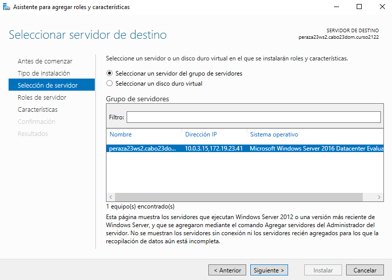
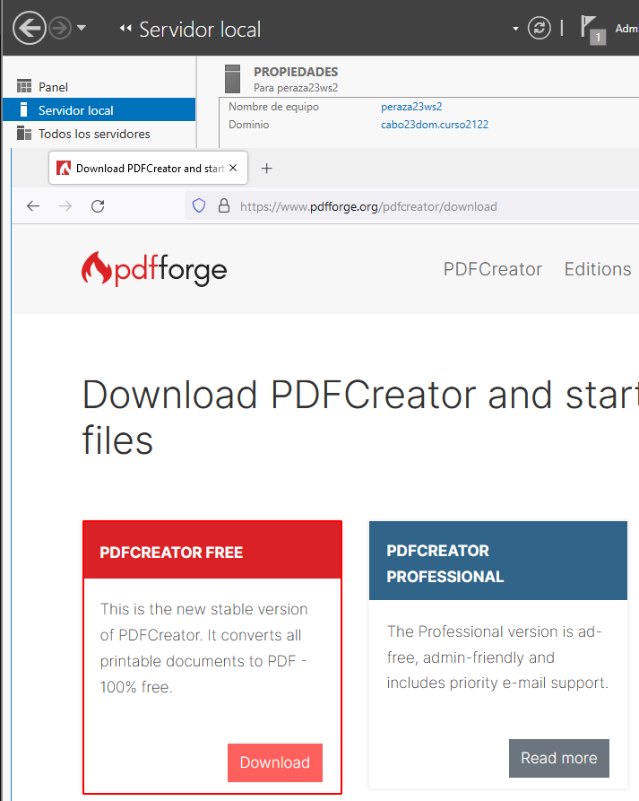
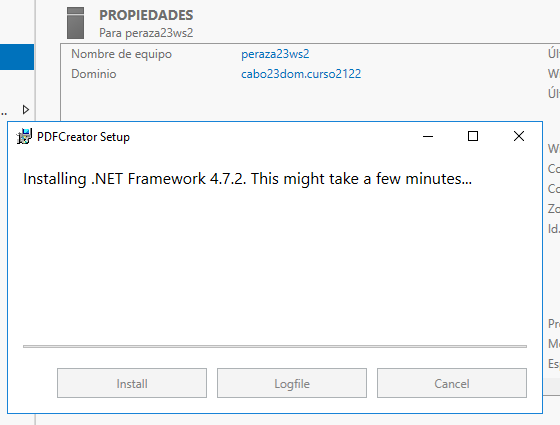
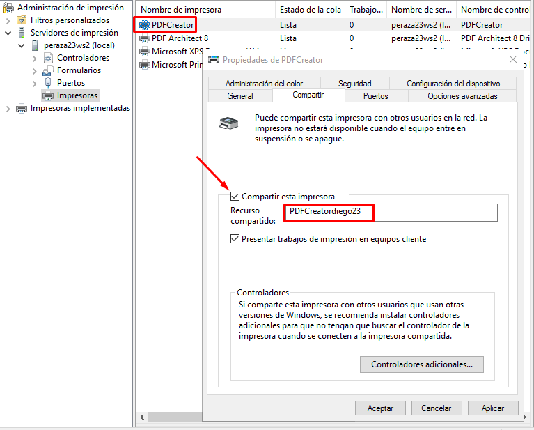
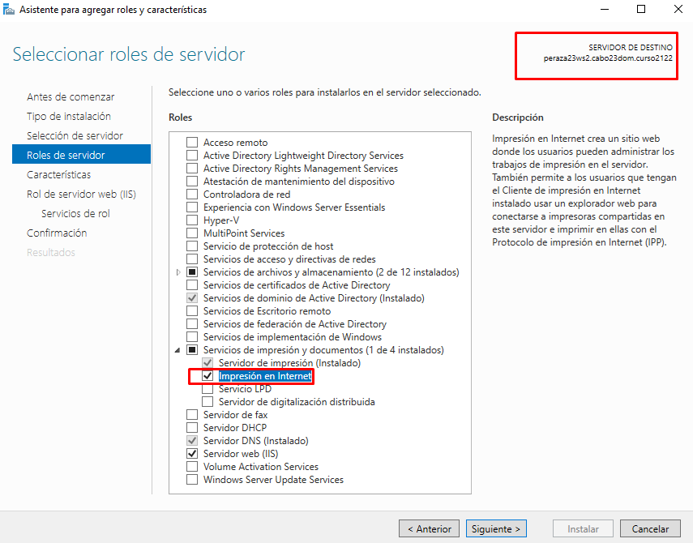
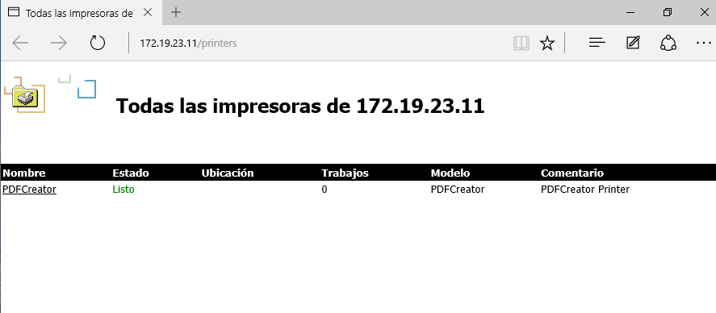
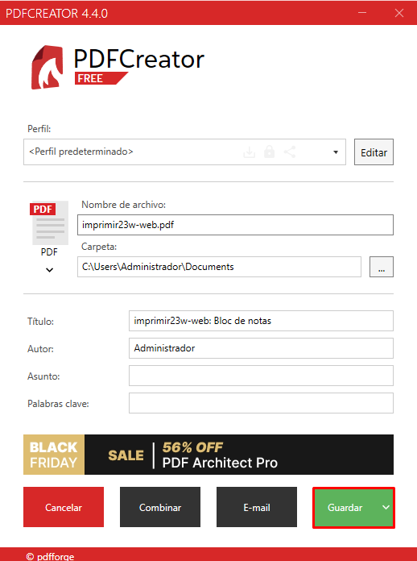

# **P1: Servidor impresión Windows**

## **1. Impresora compartida**

#### **1.1 Rol impresión**

#### **1.2 Instalar impresora PDF**

#### **1.3 Probar la impresora local**

***Para los siguientes puntos es necesario instalar Active Directory en el servidor***

## **2. Compartir por red**

#### **2.1 En el servidor**

#### **2.2 Comprobar desde el cliente**

## **3. Acceso Web**

#### **3.1 Instalar característica impresión WEB**

#### **3.2 Configurar impresión WEB**

#### **3.3 Comprobar desde el navegador**

