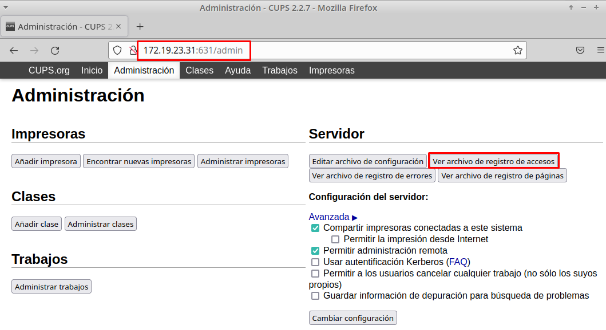
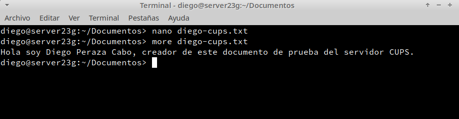

# **P1: Servidor de Impresión GNU/Linux (CUPS)**

## **1. Servidor de Impresión**

- Instalar el sistema de impresión CUPS para GNU/Linux y verificamos el estado del servicio.

- Comprobamos la conexión a la interfaz web de CUPS.

- Editar fichero de configuración CUPS (`/etc/cups/cups.conf`).

- Reiniciamos el servicio CUPS.

- Permitimos en el cortafuegos, el acceso a los servicios de impresión ``ipp`` e ``ipp-client``. En el cortafuegos hay varias zonas, para saber la que tenemos activa hacemos ``firewall-cmd --get-default-zone``.

- Vemos que el puerto CUPS (``:631``) está en escucha.

- Accederemos a la sección de ``Administración`` con el usuario/clave de root. Desde ahí accederemos a la sección ``Ver archivo de registro de accesos``.

## **2. Imprimir de forma local**

- Instalamos el paquete ``cups-pdf``.

- Creamos un archivo TXT y lo imprimimos en la impresora local.

- Comprobamos el resultado.

## **3. Imprimir de forma remota**

 **Servidor**

- Habilitamos la impresora como recurso de red compartido.

 **Cliente**

- Agregamos impresora de red.

- Creamos un archivo TXT y lo imprimimos en la impresora remota.

- Comprobamos que se ha realizado la impresión remota.

