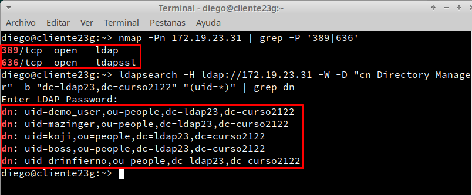
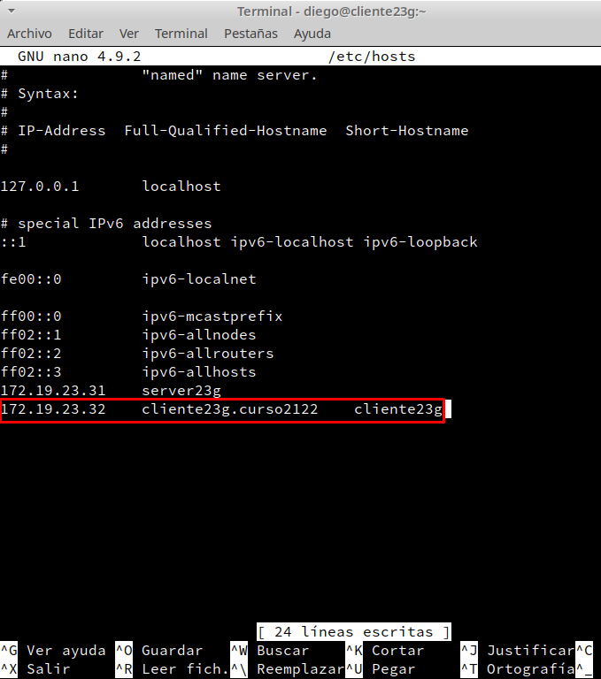
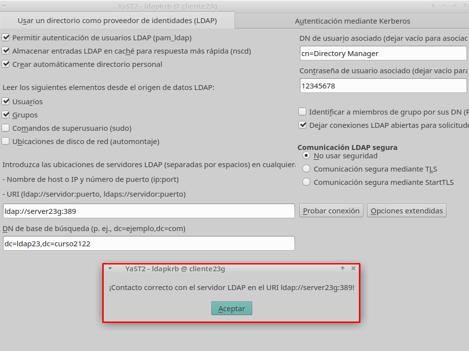
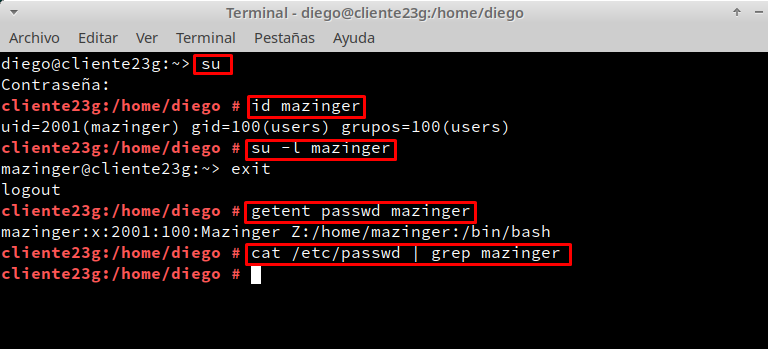
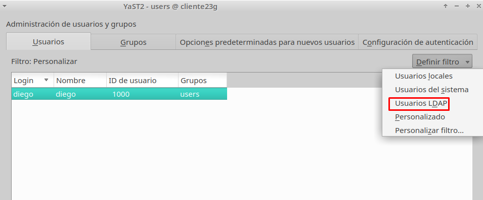
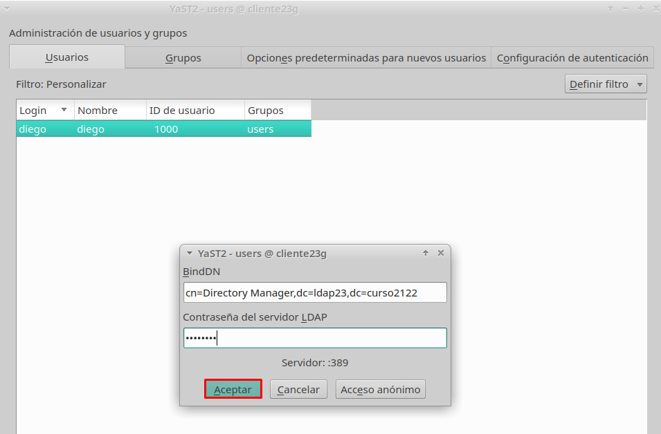
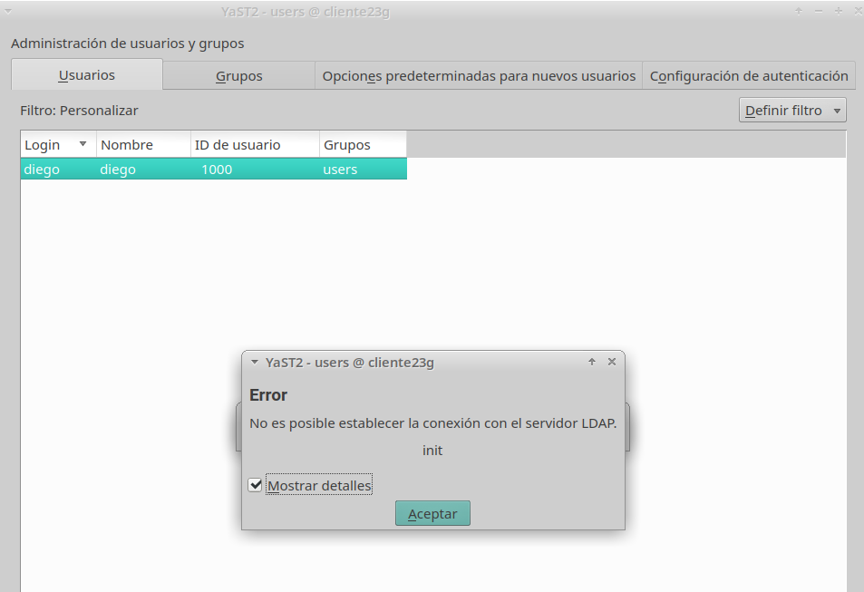

# **Autenticación 389-DS**

### **1. Preparativos**

- Iremos a la MV Cliente y comprobaremos que el servidor LDAP es accesible desde la MV Cliente y que los usuarios del LDAP remoto son visibles en el cliente.

### **2. Configurar autenticación LDAP**

#### **2.1 Crear conexión con servidor**

- Iremos a la MV cliente y nos aseguramos de tener bien el nombre del equipo y nombre de dominio.

- Vamos a ``Yast -> LDAP y Kerberos``,y allí hacemos la configuración y probaremos la conexión.

#### **2.2 Comprobar con comandos**

- Vamos a la MV cliente y en la consola pondremos los siguientes comandos con el usuario root.

### **3. Crear usuarios y grupos dentro de LDAP**

- Iremos a ``Yast -> Gestión de usuarios y grupos`` ,y en la pestaña de ``Definir filtro`` y seleccionaremos la opción de ``Usuarios LDAP``.

- Nos saldrá una ventana en la que pondremos el DN de ``Directory Manager`` y la contraseña del servidor LDAP.

- Le daremos a ``Aceptar`` y nos saldrá el siguiente error:

