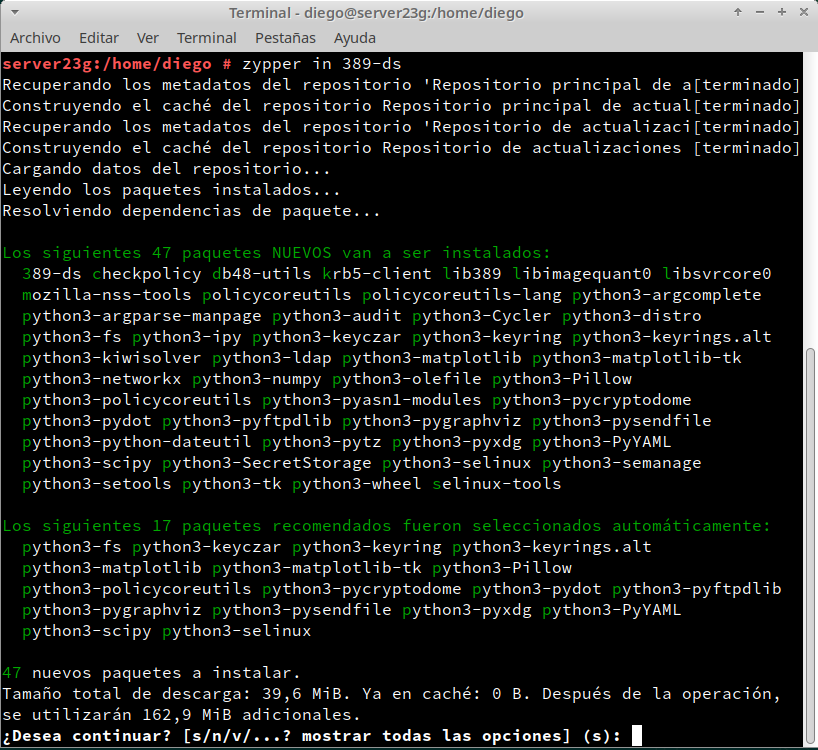

# **Servicio de Directorio con comandos**

### **1. Prerequisitos**

- Revisaremos ``/etc/hostname``

- Revisaremos ``/etc/hosts``

- Comprobamos la salida de los siguientes comandos:

### **2. Instalar el Servidor LDAP**

##### **2.1 Instalación del paquete**

- Instalamos el script de instalación:

- Comprobamos que la versión es >= 1.4.*:

##### **2.2 Configurar la instancia**

- Creamos el fichero ``/root/instance.inf`` con el siguiente contenido.

- Creamos una nueva instancia y comprobamos el estado actual de la instancia.

- Creamos el fichero /root/.dsrc con el siguiente contenido:

##### **2.3 Comprobamos el servicio**

- Comprobamos si el servicio está activo:

- Comprobamos que el servidor LDAP es accesible desde la red, pero primero permitiremos el servicio ``ldap`` y ``ldaps`` en el cortafuegos:

 

 

##### **2.4 Comprobamos el acceso al contenido del LDAP**

- Mostramos el contenido de nuestra base de datos LDAP:

- Hacemos una consulta usando usuario/clave:

### **3. Añadir usuarios LDAP por comandos**

##### **3.1 Buscar Unidades Organizativas**

  

##### **3.2 Agregar usuarios**

- Creamos el fichero `mazinger-add.ldif` con la siguiente información para crear el usuario ``mazinger``:

##### **3.3 Comprobar el nuevo usuario**

- Escribimos los datos del fichero ldif anterioren LDAP y comprobamos si se ha creado el usuario correctamente en el LDAP:

### **4. Contraseñas encriptadas**

##### **4.1 Herramienta slappasswd**

- Instalamos la herramienta ``slappasswd``:

##### **4.2 Agregar más usuarios con clave encriptada**

- **Koji**

- **Boss**

- **Doctor Infierno**

##### **4.3 Comprobar los usuarios creados**

- Iremos a la MV Cliente y comprobamos que el puerto LDAP del servidor está abierto.

- Consultamos los usuarios LDAP que tenemos en el servicio de directorio remoto.

