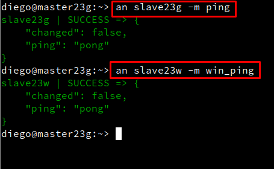
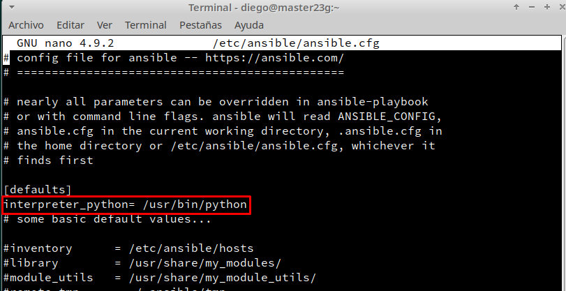
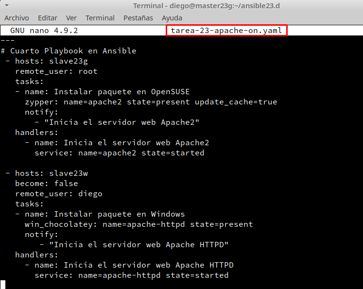
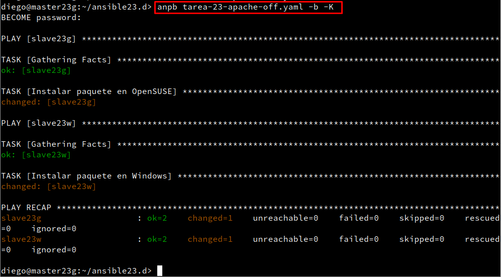

# **Orquestación con Ansible**

***Nombre:*** Diego Peraza Cabo
<br>
***Curso:*** 2º ASIR


- **Ansible** es una plataforma de software libre para configurar y administrar ordenadores.

- Combina instalación **multi-nodo** (es decir: permite desplegar configuraciones de servidores y servicios por lotes), ejecuciones de **tareas ad hoc** y administración de configuraciones.

- Adicionalmente, **Ansible** es categorizado como una herramienta de **orquestación**.

## **Índice** <a id="0"></a>

  + [1. Máquinas que vamos a utlizar y configurar](#1)
  + [2. Instalación de SSH y Ansible](#2)
    + [2.1 Instalar Ansible](#2.1)
    + [2.2 Acceso por SSH a las máquinas](#2.2)
    + [2.3. El inventario](#2.3)
  + [3. Comandos ad-hoc](#3)
  + [4. Playbook](#4)
    + [4.1 Playbook ping](#4.1)
    + [4.2 Playbook install y uninstall](#4.2)
  + [5. Handlers](#5)
### **1. Máquinas que vamos a utlizar y configurar** <a id="1"></a>

| MVs | Nombre   | Rol    | SO        | IP           |
| --- | -------- | ------ | --------- | ------------ |
| MV1 | master23g | Master | GNU/Linux | 172.19.23.51 |
| MV2 | slave23g | Slave  | GNU/linux | 172.19.23.52 |
| MV3 | slave23w | Slave  | Windows10 | 172.19.23.11 |

- Configuración de la MV1.

  

- Configuración de la MV2.

  

- Configuración de la MV3.

  

- Definir las máquinas "slave23g" y "slave23w" dentro del /etc/hosts de "master23g".

  

- Comprobamos la conectividad de las máquinas.

  - master23g a slave23g y slave23w.

    

    

[Volver](#0)

### **2. Instalación de SSH y Ansible** <a id="2"></a>

#### **2.1 Instalar Ansible** <a id="2.1"></a>

- Primero buscamos el paquete y lo instalamos.

  

  

- Comprobamos que se ha instalado correctamente:

  

- Añadimos al fichero de alias `/home/diego/.alias` lo siguiente:

  

  

#### **2.2 Acceso por SSH a las máquinas** <a id="2.2"></a>

- Instalamos el servicio SSH en MV2 y MV3.

  - MV2

    

  - MV3

    

    

    

- El usuario "diego" de la MV1 debe poder acceder por SSH sin clave a MV2 y MV3.

  - Para ello hay que hacer lo siguiente.

    

    

    

  - Comprobamos que se ha copiado bien la clave pública.

    

  - Comprobamos accediendo a slave23g por SSH.

    

  - Ahora haremos lo mismo en la MV3.

    

  - Comprobamos

    

    

#### **2.3. El inventario** <a id="2.3"></a>

- Creamos dos grupos `alumno23g` y `alumno23w` y dentro metemos las MV correspondientes.

  

[Volver](#0)

### **3. Comandos ad-hoc** <a id="3"></a>

- Usaremos Ansible para comprobar la conectividad de las máquinas del inventario.

  - Conectividad con slave23g mediante el módulo `ping`.

    

  - Conectividad con slave23w mediante el módulo `win_ping`.

    - Para tener conectividad con la MV de Windows10, tenemos que primero instalarnos el paquete windows con `ansible-galaxy`.

      

    - Segundo tenemos que activar, configurar el servicio WinRM y agregamos variables al fichero `/etc/ansible/hosts`.

      

      

      

      

      

      

      - Una vez realizado todo lo anterior deberiamos de tener conectividad.

        

      - Para que no te salga los avisos de color rosa, pondremos lo siguiente en el fichero `/etc/ansible/ansible.cfg`.

        

- Usaremos Ansible para instalar 'neofetch' en las máquinas del inventario.

  - Primero necesitamos descargarnos el paquete de neofetch con `ansible-galaxy`.

    

- Ahora instalamos ``neofetch`` en OpenSUSE mediante Ansible con el módulo ``zypper``.

  

- Pondremos otra vez el comando.

  

- Comprobamos que se ha instalado correctamente.

  

- Por último, haremos lo mismo pero con la MV slave23w. En este paso tendremos que instalar el programa `chocolatey`.

  

  

- Una vez instalado y comprobado, instalamos en vez del programa `neofetch`, el programa `winfetch` con Ansible, con el módulo `win_chocolatey`. Porque `chocolatey` no tiene el paquete `neofetch`, pero igualmente es lo mismo.

  

  

- Comprobamos que se ha instalado correctamente.

  


````
Puede que durante estos pasos tengamos algún error.
En mi caso tuve un error de que me faltaba un paquete de python, en concreto 'python-xml' en la máquina slave23g.
Lo solucioné poniendo lo siguiente.


````

[Volver](#0)

  

### **4. Playbook** <a id="4"></a>

#### **4.1 Playbook ping** <a id="4.1"></a>

  - Crear el directorio `/home/diego/ansible23.d` y nos movemos dentro.

    

  - Crear fichero `tarea-23-ping.yaml`, dentro de la carpeta `/home/diego/ansible23.d`, con el siguiente contenido.

    

  - Comprobamos.

    

#### **4.2 Playbook install y uninstall** <a id="4.2"></a>

  - Crear fichero `tarea-23-install.yaml`, dentro de la carpeta `/home/diego/ansible23.d`, con el siguiente contenido.

    

  - Comprobamos.

    - slave23g

      

    - slave23w

      

  - Volvemos a introducir el comando y vemos que está todo correcto.

    

  -  Crear fichero `tarea-23-uninstall.yaml`, dentro de la carpeta `/home/diego/ansible23.d`,con el siguiente contenido.

    

  - Comprobamos

    - slave23g

      

    - slave23w

      

    - Volvemos a introducir el comando y vemos que está todo correcto.

      

[Volver](#0)

### **5. Handlers** <a id="5"></a>

  -  Crear fichero `tarea-23-apache-on.yaml`, dentro de la carpeta `/home/diego/ansible23.d`,con el siguiente contenido.

    

  - Comprobamos.

    - slave23g

      

      

    - slave23w

      

      

      

  - Crear fichero `tarea-23-apache-off.yaml`, dentro de la carpeta `/home/diego/ansible23.d`,con el siguiente contenido.

    

  - Comprobamos

    

    

    

[Volver](#0)
