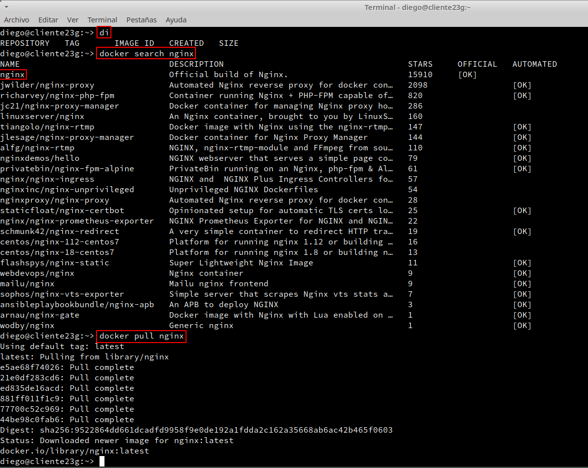
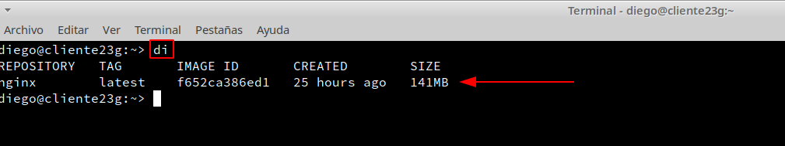
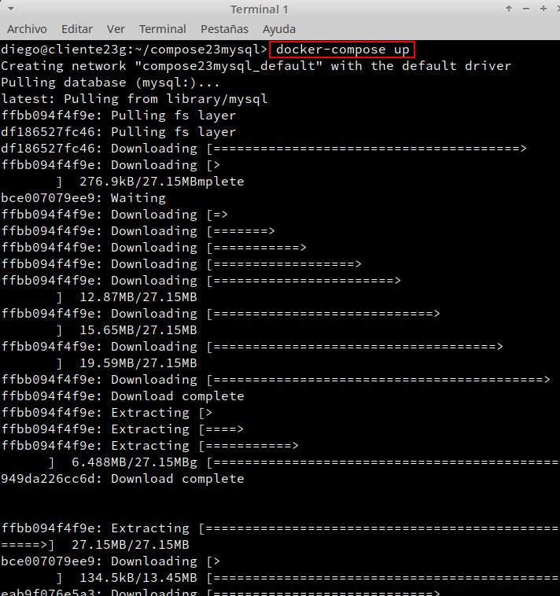

# **Docker-Compose**

## **1. Instalar docker-compose**

- Buscamos el paquete en los repositorios y lo instalamos como sudo.

- Comprobamos la versión que hemos instalado.

## **2. Gestionar un contenedor Nginx**

### **2.1 Descargar imagen**

- Consultamos las imágenes instaladas, buscamos el contenedor de nginx y lo descargamos.

- Comprobamos que tenemos la imagen de nginx descargada correctamente.

### **2.2 Gestionar Nginx con volumen**

- Creamos la carpeta `compose23nginx`, dentro de esta carpeta creamos el archivo ``docker-compose.yaml`` y  creamos una carpeta que dentro tenga un ``index.html``.

- Comprobamos que la configuración del fichero ``docker-compose.yaml`` está bien escrita, vemos que todavía no se ha creado el contenedor y lo iniciaremos.

- Comprobamos que se ha creado el contenedor.

- Abrimos un navegador web con la siguiente URL `localhost:8081` y comprobamos de que se ve nuestra página web.

### **2.3 Cambios en "caliente"**

- Ahora vamos a ver que si hacemos cambios en el contenido de los ficheros dentro del volumen, podemos hacer cambios en "caliente".

- Una vez hecho lo anterior, ejecutamos los siguientes comandos:

## **3. Gestionar un contenedor MYSQL con volumen**

- Vamos a la web de `hub.docker.com` y buscamos el contenedor Mysql.

- Creamos el directorio `compose23mysql` y dentro, el directorio `data`, además de crear el fichero ``docker-compose.yaml`` con el siguiente contenido y validarlo.

- Ahora levantamos los contenedores y comprobamos que están en ejecución. Además comprobamos que el puerto de Mysql está abierto.

- Descargamos el cliente Mysql para acceder a la base de datos que gestiona el contenedor, y vamos a escribir algo dentro.

- Destruimos los contenedores y comprobamos.

- Volvemos a levantar los contenedores y usamos el cliente Mysql para volver a entrar en la base de datos y confirmar que se mantiene la información que habíamos escrito.

## **4. Gestionar dos contenedores**

- Crearemos los siguientes directorios y comprobamos.

- Creamos el fichero ``docker-compose.yaml`` con el siguiente contenido y comprobamos que la sintaxis del fichero está correcta.

- Levantamos el contenedor, comprobamos que se han descargado las dos imágenes.

- Comprobamos que los contenedores están en ejecución.

- Y por último comprobamos de que funciona correctamente.

