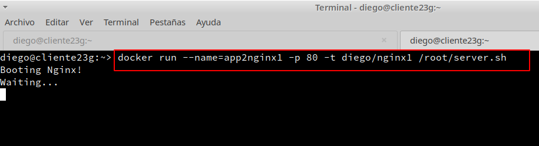

# **Contenedores con Docker**

### **1. Instalación**

- Instalamos docker en OpenSUSE:

- Inicamos el servicio, lo habilitamos para que automáticamente se inicie al encender la máquina, miraremos el estado del servicio y por último consultaremos que el estado de IP_FORWARD esté activo.

#### **1.1 Primera prueba**

**Como usuario root**

- Incluiremos a nuestro usuario (diego) como miembro del grupo docker y mostraremos que pertenecemos al grupo docker.

- Cerraremos sesión y volveremos a entrar al sistema con nuestro usuario normal.

**Como usuario normal**

- Comprobamos que se muestra la información de las versiones cliente y servidor.

- Descargaremos una imagen `hello-world`, creamos un contenedor y ejecutamos la aplicación que hay dentro. Además comprobamos que ahora vemos la nueva imagen descargada en nuestro equipo local.

- Vemos que hay un contenedor en estado `Exited`, pararemos el contenedor identificado por su IDContainer, y por último lo eliminaremos.

#### **1.2 Alias**

- Para trabajar de forma más rapida crearemos el siguiente fichero y pondremos el siguiente contenido.

### **2. Creación manual de nuestra imagen**

#### **2.1 Crear un contenedor manualmente**

**Descargamos una imagen**

- Buscamos  en los repositorios de Docker Hub contenedores con la etiqueta ``debian``.

- Descargamos una imagen en local y comprobamos que se ha descargado correctamente.

**Creamos un contenedor**

- Vamos a crear un contenedor con nombre ``app1debian`` a partir de la imagen ``debian``, y ejecutaremos el programa ``/bin/bash`` dentro del contenedor:

#### **2.2 Personalizar el contenedor**

**Instalar aplicaciones dentro del contenedor**

- Comprobamos que estamos en Debian, actualizamos los paquetes, instalamos nginx y vim en el contenedor.

- Comprobamos que se han descargado las dos aplicaciones.

**Crear un fichero HTML `holamundo1.html`**

**Creamos un script `/root/server.sh` y le pondremos permisos de ejecución**

#### **2.3 Creamos una imagen a partir del contenedor**

- Abriremos otra ventana de terminal, y a partir del contenedor modificado vamos a crear la nueva imagen que se llamará `diego/nginx1`. Comprobamos que se ha creado la nueva imagen, pararemos el contenedor y los eliminamos.

### **3. Crear un contenedor a partir de nuestra nueva imagen**

#### **3.1 Creamos contenedor con Nginx**

- Iniciamos el contenedor a partir de la imagen anterior.

- No cerraremos la terminal, ni pararemos el contenedor.

#### **3.2 Comprobamos**

- Abrimos una nueva terminal, y mostramos los contenedores en ejecución.

- Abrimos el navegador web y pondremos la siguiente URL `0.0.0.0:49153`.

- Comprobamos el acceso al fichero HTML.

- Paramos y eliminamos el contenedor.

#### **3.3 Migrar la imagen a otra máquina**

**Exportar imagen Docker a fichero tar:**

**Importar imagen Docker desde fichero:**

- Cargamos la imagen Docker de nuestro compañero a partir del fichero tar. Comprobamos que la nueva imagen está disponible y probamos a crear un contenedor a partir de la nueva imagen.

#### **3.4 Capas**

- Consultamos las capas de la imagen del compañero.

### **4. Dockerfile**

#### **4.1 Preparar ficheros**

- Crear el directorio `/home/diego/docker23local` y entramos en él para crear los ficheros ``holamundo2.html`` y ``Dockerfile`` con el siguiente contenido:

#### **4.2 Crear imagen a partir del `Dockerfile`**

- Entramos al directorio `/home/diego/docker23local`, y construimos una nueva imagen a partir del ``Dockerfile``.

- Comprobamos que aparece nuestra nueva imagen.

#### **4.3 Crear contenedor y comprobar**

- Creamos un contenedor con el nombre `app4nginx2`a partir de la imagen ``diego/nginx2`` y desde otra terminal comprobamos que el contenedor está en ejecución y en escucha por el puerto deseado.

- Comprobamos en el navegador.

#### **4.4 Usar imágenes ya creadas**

- Creamos el directorio `docker23web`y entramos para crear los ficheros `holamundo3.html` y `Dockerfile` con el siguiente contenido:

- Creamos la imagen y el contenedor, y comprobamos el acceso a `holamundo3.html`

### **5. Docker Hub**

#### **5.1 Creamos los ficheros necesarios**

Crear nuestra imagen `holamundo`:

- Crear carpeta `docker23push` y entrar para crear un script (`holamudno23.sh`) y el fichero `Dockerfile` con el siguiente contenido:

- Creamos la imagen `diego/holamundo` a partir del `Dockerfile` anterior.

- Comprobamos que se crea un contenedor que ejecuta el script. Lo eliminaremos si todo va bien.

#### **5.2 Subir la imagen a Docker Hub**

- Nos registramos en Docker Hub.

- Abrimos la conexión, eitquetamos la imagen con `version1` y subimos la imagen a los repositorios de Docker.

#### **6. Limpiar contenedores e imágenes**

- Paramos y eliminamos todos los contenedores:

- Eliminamos todas las imágenes:

