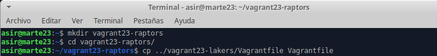

# **Vagrant con VirtualBox**

### **1. Instalación de Vagrant**

- Instalamos Vagrant en la máquina real y comprobamos que las versiones de Vagrant y VirtualBox sean compatibles entre sí.

### **2. Proyecto Celtics**

#### **2.1 Imagen, caja o box**

- Descargaremos la caja que necesitamos a través de vagrant y comprobamos con el comando ``vagrant box list``.

#### **2.2 Directorio**

- Creamos un directorio para nuestro proyecto.

- Ahora dentro de esta carpeta crearemos un nuevo fichero nuevo llamado ``Vagrantfile`` con el siguiente contenido.

#### **2.3 Comprobar**

- Debemos de estar dentro de `vagrant23-celtics`, e iniciaremos una nueva instancia de la máquina.

- Una vez iniciada la máquina nos conectaremos a nuestra MV usando SSH.

### **3. Proyecto Hawks**

#### **3.1 Creamos proyecto Hawks**

- Creamos la carpeta `vagrant23-hawks`, y dentro crearemos el fichero `Vagrantfile` con el siguiente contenido:

- Iniciamos la MV y entraremos por SSH, para instalar dentro apache2.

#### **3.2 Comprobar**

- Vemos la redirección de puertos de la máquina Vagrant.

- Abrimos el navegador web con el siguiente URL.

### **4. Suministro**

- Apgaremos la MV y la destruimos para volver a empezar.

#### **4.1 Proyecto Lakers**

- Creamos directorio `vagrant23-lakers`, entraremos en la carpeta y crearemos la carpeta html con el siguiente contenido:

- Crearemos el script `install_apache.sh` dentro del proyecto.

- Además crearemos el fichero de configuración `Vagrantfile` con el siguiente contenido:

- Una vez terminado el fichero de configuración, iniciaremos la MV.

- Podemos ver mensajes en los que se ve como se van instalando los paquetes de Apache.

- Entraremos dentro de la MV  con SSH para verificar si se ha instalado apache2.

- Volveremos al fichero `Vagrantfile` , pondremos la siguiente línea y recargaremos la configuración.

- Comprobamos abriendo el navegador en la máquina real con la siguiente URL:

#### **4.2 Proyecto Raptors**

- Creamos el directorio `vagrant23-raptors` ,y copiaremos el fichero ``Vagrantfile`` de la carpeta `vagrant23-lakers`.

- Modificaremos el archivo con el siguiente contenido:

- Crearemos la carpeta `manifests` y dentro el archivo `diego23.pp` de la siguiente forma:

- Copiaremos el script de la carpeta `vagrant23-lakers` , para nuestro proyecto raptors.

- Iniciaremos la MV y entraremos por SSH, para comprobar de que se ha instalado nuestro paquete correctamente.

