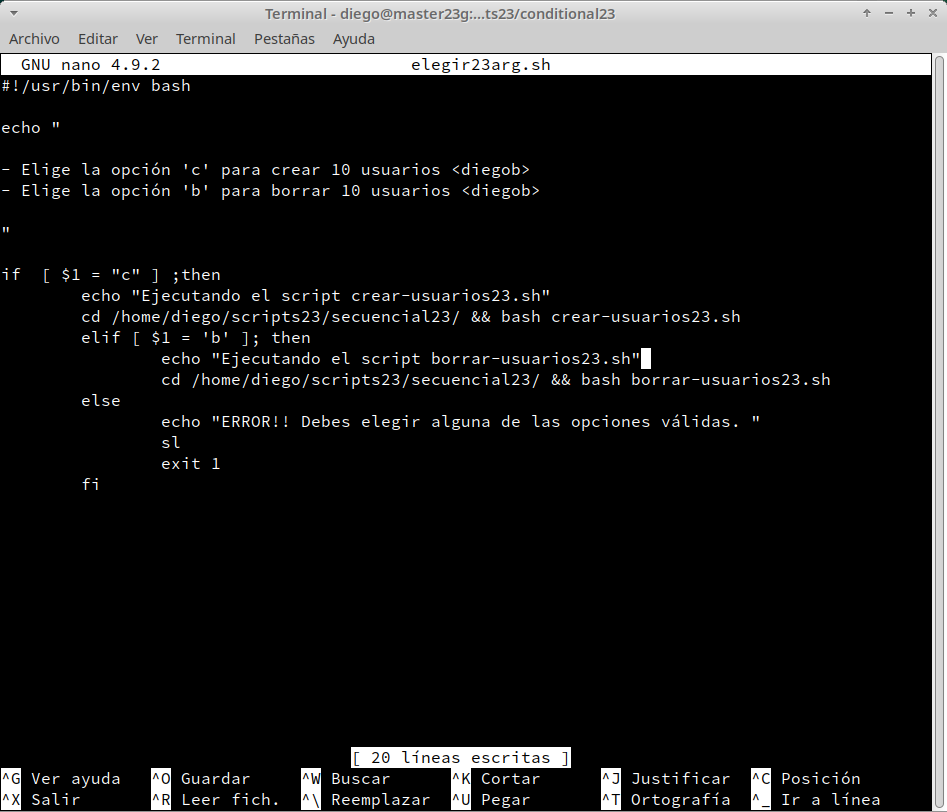
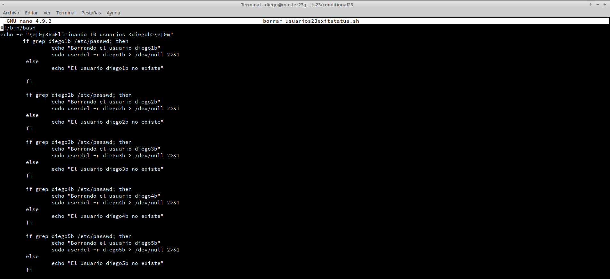

# **Scripting: Estructura condicional**

***Nombre:*** Diego Peraza Cabo
 
***Curso:*** 2º ASIR

## **Índice** 

+ [0. Scripts](#00)
+ [1. Práctica en Bash condicional](#1)
  + [1.1 Condicional preguntando al usuario](#1.1)
  + [1.2 Comprobamos](#1.2)
  + [1.3 Condicional usando variable fija](#1.3)
  + [1.4 Condicional usando argumentos](#1.4)
+ [2. Práctica en Ruby](#2)
  + [2.1 Condicional preguntando al usuario](#2.1)
  + [2.2 Comprobamos](#2.2)
  + [2.3 Condicional usando variable fija](#2.3)
  + [2.4 Condicional usando argumentos](#2.4)
+ [3. Mejorar con código de salida (exit status)](#3)

### **0. Scripts** 

  + [conditional23.zip](files-conditional/conditional23.zip)

[Volver](#0)

### **1. Práctica en Bash condicional** 

-  Para las dos prácticas que vamos a relizar crearemos el directorio `/home/diego/scripst23/conditional23` y nos movemos a él.

  

- Además nos descargamos el paquete `sl`.

  

#### **1.1 Condicional preguntando al usuario** 

- Creamos el script `elegir23user.sh`, con el siguiente contenido:

  

#### **1.2 Comprobamos** 

- Creando los usuarios.

  

- Borrando los usuarios.

  

#### **1.3 Condicional usando variable fija** 

- Creamos el script `elegir23var.sh`, con el siguiente contenido:

  

- Comprobamos.

  

#### **1.4 Condicional usando argumentos** 

- Creamos el script `elegir23arg.sh`, con el siguiente contenido:

  

- Comprobamos

  

  

[Volver](#0)

### **2. Práctica en Ruby** 

#### **2.1 Condicional preguntando al usuario** 

- Creamos el script `elegir23user.rb`, con el siguiente contenido:

  

#### **2.2 Comprobamos** 

- Creando los usuarios.

  

- Borrando los usuarios.

  

#### **2.3 Condicional usando variable fija** 

- Creamos el script `elegir23var.rb`, con el siguiente contenido:

  

- Comprobamos.

  

#### **2.4 Condicional usando argumentos** 

- Creamos el script `elegir23arg.rb`, con el siguiente contenido:

  

- Comprobamos.

  - Creando los usuarios.

    

  - Borrando los usuarios.

    

  - Argumento no válido.

    

    

[Volver](#0)

### **3. Mejorar con código de salida (exit status)** 

- Exit status con Bash.

  - Creamos el script `crear-usuarios23exitstatus.sh`, con el siguiente contenido:

    

  - Creamos el script `borrar-usuarios23exitstatus.sh`, con el siguiente contenido:

    

- Exit status con Ruby.

  - Creamos el script `crear-usuarios23exitstatus.rb`, con el siguiente contenido:

    

  - Creamos el script `borrar-usuarios23exitstatus.rb`, con el siguiente contenido:

    

- Comprobamos.

  - Exit status con Bash.

    

    

  - Exit status con Ruby.

    

    

[Volver](#0)
