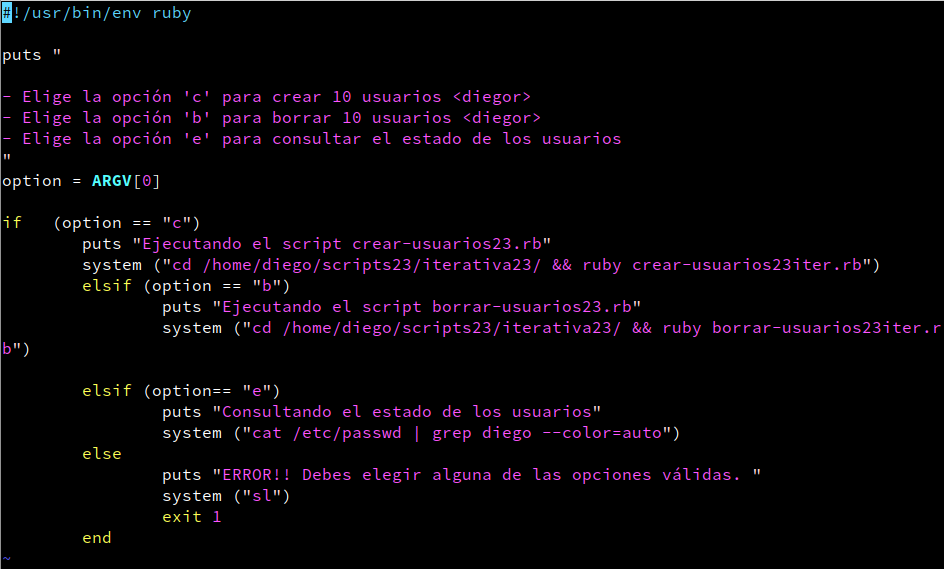

# **Scripting: Estructura iterativa**

***Nombre:*** Diego Peraza Cabo
 
***Curso:*** 2º ASIR

## **Índice** 

+ [0. Scripts](#00)
+ [1. Práctica en Bash](#1)
  + [1.1 Crear usuarios](#1.1)
  + [1.2 Borrar usuarios](#1.2)
  + [1.3 Elegir argumento](#1.3)
+ [2. Práctica en Ruby](#2)
  + [2.1 Crear usuarios](#2.1)
  + [2.2 Borrar usuarios](#2.2)
  + [2.3 Elegir argumento](#2.3)

### **0. Scripts** 
- **Bash**
    + [crear-usuarios23iter.sh](files_iter/crear-usuarios23iter.sh)
    + [borrar-usuarios23iter.sh](files_iter/borrar-usuarios23iter.sh)
    + [elegir23arg.sh](files_iter/elegir23arg.sh)

- **Ruby**
  + [crear-usuarios23iter.rb](files_iter/crear-usuarios23iter.rb)
  + [borrar-usuarios23iter.rb](files_iter/borrar-usuarios23iter.rb)
  + [elegir23arg.rb](files_iter/elegir23arg.rb)

### **1. Práctica en Bash** 

- Creamos el directorio `/home/diego/scripts23`, nos movemos dentro y creamos otra carpeta con el nombre de `iterativa23`, que es donde vamos a realizar la práctica.

  

- Además instalamos el paquete `figlet`.

  

#### **1.1 Crear usuarios** 

- Creamos el script `crear-usuarios23iter.sh`, que sería como la segunda versión del script secuencial `crear-usuarios23.sh`. Este script sirve para crear un número de 10 usuarios en el sistema con el nombre de `diego1b`, `diego2b`, etc.

  

- Para este script lo primero que hice fue poner mi nombre como variable `user`, lo segundo crear un bucle que lo que hiciese, es que la variable `i` contára del 1 al 10 incluyendolos.

- Tercero, cree una variable `us` que sumase las dos variables anteriores `user` y `i`.

- Cuarto, indique un condicional en el que si ya estaban creado los usuarios, pusiera como que ya existen y un `exit 0` para salir del programa, y si no lo estaban pues se creaban automáticamente.

- Quinto, puse el comando `cat /etc/passwd | grep diego`, para comprobar de que se han creado los usuarios correctamente.

- Y por último, puse colores en todos los comandos `echo`, para aplicar el color tenía que poner `echo -e` y además el código de color dentro del contenido.

- Comprobamos.

  

#### **1.2 Borrar usuarios** 

- Creamos y realizamos el script `borrar-usuarios23iter.sh`, para borrar los usuarios creados en el punto anterior.

  

- Para este script lo que hice fue más o menos lo mismo que en `crear-usuarios23.sh`, ya que solo modifique el comando `useradd` a `userdel`.

- Además añadí la siguiente línea al comando para que ocultase la salida de `no crontab for diego2b`= `> /dev/null 2>&1`,y también añadí el comando `cowsay ....`.

- El **'>>'** sirve para redireccionar la salida,**'/dev/null'** es un archivo pseudodispositivo que acepta y descarta todas las entradas, o sea no produce salidas. Y **'2>&1'** es un descriptor de archivo,ya que simplemente dice de redirigir el errór estándar a la salida estándar.

- Comprobamos.

  

#### **1.3 Elegir argumento** 

- Creamos el script `elegir23arg.sh`, que será la segunda versión del script condicional, pero en este caso se modificará para invocar a los scripts nuevos que acabamos de modificar para que sean interactivos.

- Además añadimos una nueva opción "e" para consultar el estado actual de los usuarios.

  

- Comprobamos.

  - Consultamos el estado de los usuarios.

    

  - Creamos los 10 usuarios <diegob>.

    

  - Consultamos el estado de los usuarios.

    

  - Borramos los 10 usuarios <diegob>.

    

  - Consultamos el estado de los usuarios.

    

  - Argumento no válido.

    

[Volver](#0)

### **2. Práctica en Ruby** 

- Para esta práctica tenemos que estar en el directorio `/home/diego/scripts23/iterativa23`.

#### **2.1 Crear usuarios** 

- Creamos y realizamos el script `crear-usuarios23iter.rb`, para crear un número de 10 usuarios en el sistema con el nombre de `diego1r`, `diego2r`, etc.

  

- Vemos que Ruby es muy parecido al lenguaje de Bash, por ejemplo para mostrar texto en Bash pondremos el comando `echo`, pero en Ruby se usa el comando `puts`.

- Después para el bucle no hace falta poner las llaves.

- Cuando hagamos el condicional `if` será lo mismo que en Bash, pero para poner que existe un directorio pondremos `File.directory?` en vez de `if [-d ..]`.

- Los comandos se ejecutarán con el método `system ("COMANDO")`.

- Comprobamos.

  

#### **2.2 Borrar usuarios** 

- Creamos y realizamos el script `borrar-usuarios23iter.rb`, para borrar los usuarios creados en el punto anterior.

  

- Para este script lo que hice fue más o menos lo mismo que en `crear-usuarios23.rb`, ya que solo modifique el comando `useradd` a `userdel`. Además añadí la siguiente línea al comando para que ocultase la salida de `no crontab for diego2b`= `> /dev/null 2&1` ,y también añadí el comando `xcowsay ....`.

- Comprobamos.

  

#### **2.3 Elegir argumento** 

- Creamos el script `elegir23arg.sh`, que será la segunda versión del script condicional, pero en este caso se modificará para invocar a los scripts nuevos que acabamos de modificar para que sean interactivos.

- Además añadimos una nueva opción "e" para consultar el estado actual de los usuarios.

  

- Comprobamos.

  - Consultamos el estado de los usuarios.

    

  - Creamos los 10 usuarios <diegob>.

    

  - Consultamos el estado de los usuarios.

    

  - Borramos los 10 usuarios <diegob>.

    

  - Consultamos el estado de los usuarios.

    

  - Argumento no válido.

    

[Volver](#0)
