# **Scripting: Estructura secuencial**

***Nombre:*** Diego Peraza Cabo
 
***Curso:*** 2º ASIR

## **Índice** 

  + [0. Scripts](#00)
  + [1. Práctica en Bash](#1)
    + [1.1 Crear usuarios](#1.1)
    + [1.2 Borrar usuarios](#1.2)
  + [2. Práctica en Ruby](#2)
    + [2.1 Crear usuarios](#2.1)
    + [2.2 Borrar usuarios](#2.2)

### **0. Scripts** 

#### **Bash**
  + [crear-usuarios23.sh](files_new/crear-usuarios23.sh)
  + [borrar-usuarios23.sh](files_new/borrar-usuarios23.sh)

#### **Ruby**

+ [crear-usuarios23.rb](files_new/crear-usuarios23.rb)
+ [borrar-usuarios23.rb](files_new/borrar-usuarios23.rb)

[Volver](#0)

### **1. Práctica en Bash** 

- Para las dos prácticas que vamos a relizar crearemos un directorio `/home/diego/scripst23` y nos movemos a él.

  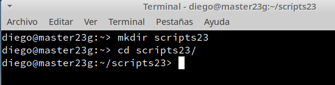

- Además, nos descargamos el paquete ``cowsay`` y el paquete ``whois``.

  

  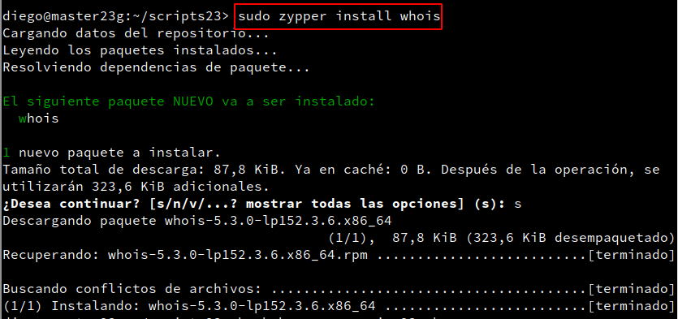

#### **1.1 Crear usuarios <diegob>** 

- Creamos y realizamos el script `crear-usuarios23.sh`, para crear un número de 10 usuarios en el sistema con el nombre de `diego1b`, `diego2b`, etc. Para poner la contraseña a los usuarios pondremos lo siguiente: `-p "$(mkpasswd --method=sha-512 'diego1b')`, esto sirve para que encripte la contraseña que vamos a poner, que en este caso es el nombre de usuario.

  

##### **Comprobamos**

  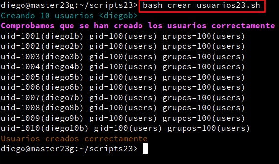

- Iniciamos sesión con algún usuario creado.

  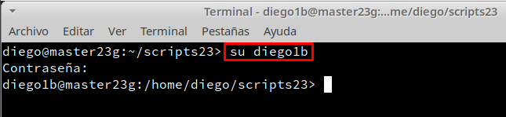

#### **1.2 Borrar usuarios <diegob>** 

- Creamos y realizamos el script `borrar-usuarios23.sh`, para borrar los usuarios creados en el punto anterior.

  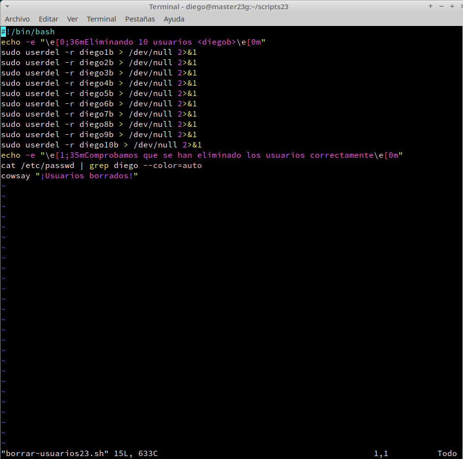

- Para este script lo que hice fue más o menos lo mismo que en `crear-usuarios23.sh`, ya que solo modifique el comando `useradd` a `userdel`. Además añadí la siguiente línea al comando para que ocultase la salida de `no crontab for diego2b`= `> /dev/null 2&1`,y también añadí el comando `cowsay ....`.

##### **Comprobamos**

  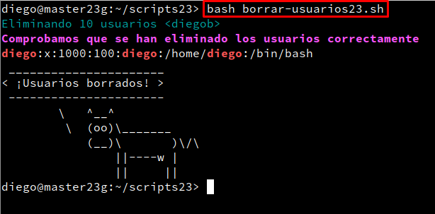

[Volver](#0)

### **2. Práctica con Ruby** 

- Para esta práctica tenemos que estar en el directorio `/home/diego/scripts23`.

- Además tenemos que descarganos el paquete `xcowsay`.

  

#### **2.1 Crear usuarios <diegor>** 

- Creamos y realizamos el script `crear-usuarios23.rb`, para crear un número de 10 usuarios en el sistema con el nombre de `diego1r`, `diego2r`, etc. Para poner la contraseña a los usuarios pondremos lo siguiente: `-p $(mkpasswd --method=sha-512 'diego1r')`, esto sirve para que encripte la contraseña que vamos a poner, que en este caso es el nombre de usuario.

  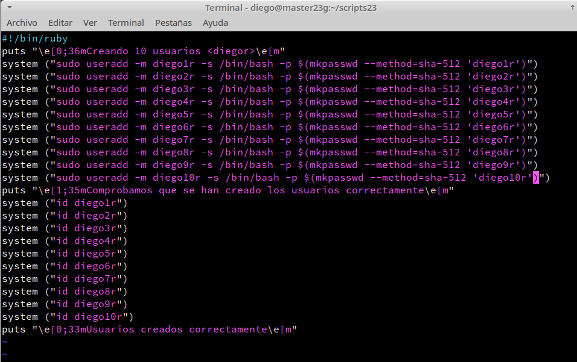

- Vemos que Ruby es muy parecido al lenguaje de Bash, por ejemplo para mostrar texto en Bash pondremos el comando `echo`, pero en Ruby se usa el comando `puts`.

- Los comandos se ejecutarán con el método `system ("COMMAND")`.

##### **Comprobamos**

  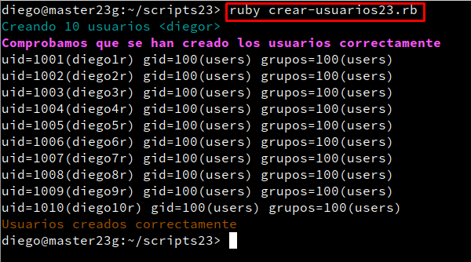

- Iniciamos sesión con algún usuario creado.

  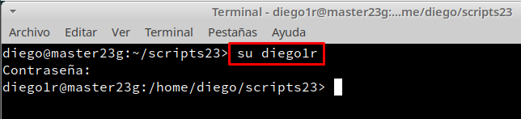

#### **2.2 Borrar usuarios <diegor>** 

- Creamos y realizamos el script `borrar-usuarios23.rb`, para borrar los usuarios creados en el punto anterior.

  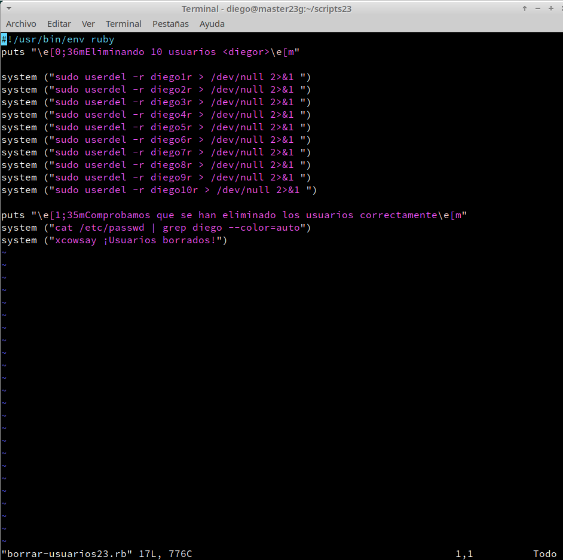

- Para este script lo que hice fue más o menos lo mismo que en `crear-usuarios23.rb`, ya que solo modifique el comando `useradd` a `userdel`. Además añadí la siguiente línea al comando para que ocultase la salida de `no crontab for diego2b`= `> /dev/null 2&1` ,y también añadí el comando `xcowsay ....`.

##### **Comprobamos**

  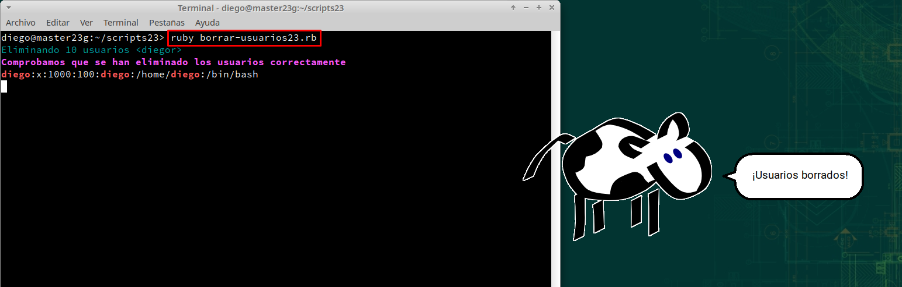

[Volver](#0)
