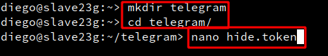

# **Servicio de comunicaciones con Telegram (bot-service)**

***Nombre:*** Diego Peraza Cabo
 
***Curso:*** 2º ASIR

## **Índice** 

+ [1. Crear un bot de Telegram con Ruby](#1)
  + [1.1 Crar bot con BotFather](#1.1)
  + [1.2 Crear un programa de Ruby](#1.2)
  + [1.3 Entrega](#1.3)
+ [2. Sytemd](#2)
  + [2.1 Crear un servicio](#2.1)
  + [2.2 Iniciar y activar el servicio](#2.2)
  + [2.3 Parar el proceso](#2.3)
  + [2.4 Entrega](#2.4)
+ [3. Programar tareas](#3)
  + [3.1 Controlador](#3.1)
  + [3.2 Tareas programadas](#3.2)
  + [3.3 Entrega](#3.3)

### **1. Crear un bot de Telegram con Ruby** 

##### **1.1 Crar bot con BotFather** 

- Iniciamos telegram y buscamos el usuario `@BotFather`, también empezaremos la conversación y con la creación de nuestro bot con la orden `/newbot`.

  

  

  

  

- Ponemos como nombre del Bot `@Bot_diego23` y del nombre de usuario `diego23_bot`. Apuntamos los siguientes datos para usarlos más adelante:

  - Bot URL
  - TOKEN (HTTP API)

    

- Ahora vamos a crear un grupo de Telegram y añadimos al bot creado anteriormente. Para crear el grupo tendremos que dirigirnos a la parte inferior izquierda y darle click a `Lapiz -> New Group`.

  

  

- Buscamos nuestro bot y lo añadimos al grupo.

  

- De nombre del grupo podremos ponerlo como queramos, pero en mi caso puse `bot-service`.

  

- Una vez hecho todo lo anterior le damos a la flecha de abajo izquierda y ya tendriamos creado el grupo con neustro bot.

  

##### **1.2 Crear un programa de Ruby** 

- Instalamos la gema de ruby que permite comunicarse con Telegram.

  

- Vemos que nos ha dado un error en la instalación de la gema anterior, para solucionarlo nos instalamos la siguiente gema.

  

- Una vez solucionado el problema, volvemos a instalarnos la gema `telegram-bot-ruby`.

  

- Creamos el directorio `telegram` en nuestra carpeta `/home/diego`, además accedemos dentro de la carpeta crear y añadimos el fichero `hiden.token` para que tenga nuestro TOKEN del Bot dentro.

  

  

- Una vez realizado el paso anterior, ejecutamos el programa de ejemplo de la actividad. Solo tendremos que cambiar el valor de `bot_username` a nuestro usuario.

  

  

- Iniciamos `bot-demo.rb`.

  

- Comprobamos su funcionamiento en el Telegram.

  

##### **1.3 Entrega** 

  + [Script Bot23d](files/bot23.rb)
  + [Funcionamiento del Bot23d](https://www.youtube.com/watch?v=FRh22RLe1ew)

[Volver](#0)

### **2. Sytemd** 

- Vamos a crear un servicio para nuestro Bot, de modo que se inicie siempre al arrancar el equipo y que podemos gestionarlo como el resto de servicios (usando el comando ``systemctl``).

##### **2.1 Crear un servicio** 

- Copiamos el script a `/usr/local/bin/bot23d` y lo hacemos ejecutable.

  

- Creamos el directorio `/etc/bot23`, nos movemos a él y creamos el fichero token, que servirá para guardar nuestro TOKEN del bot de Telegram.

  

- Además modificamos el contenido del script para cambiar la ruta del TOKEN.

  

- Creamos el fichero `/etc/systemd/system/bot23.service`, con el siguiente contenido:

  

##### **2.2 Iniciar y activar el servicio** 

- Comprobamos que el estado del servicio está parado. Ahora iniciamos el servicio , comprobamos que está activo y por último habilitamos el servicio, de modo que se inicie automáticamente.

  

##### **2.3 Parar el proceso** 

- Localizamos el identificador del proceso (PID) bot23d. Una vez localiczado el PID, emitimos una orden para que se cierre el proceso.

  

- Comprobamos que el proceso `bot23d` no está y el servicio esta parado. Iniciamos el servicio con `systemctl start bot23` y comprobamos.

  

##### **2.4 Entrega** 

  + [bot23.service](files/bot23.service)

[Volver](#0)

### **3. Programar tareas** 

##### **3.1 Controlador** 

- Creamos un nuevo script `/usr/local/bin/bot23controller`, con el siguiente contenido.

  

- Lo que hace este script es consultar si el estado del servicio está parado o en ejecución. Si está parado lo inicia y manda un mensaje al fichero ``log`` , que hemos creado nosotros, de que se está iniciando el servicio. Y si ya está en ejecución solo manda un mensaje al archivo ``log`` de que no hace nada porque ya está activo el servicio.

- Comprobamos el funcionamiento del script.

  

##### **3.2 Tareas programadas** 

- Vamos a programar el script ``bot23controller`` para que se ejecute cada 5 minutos. Usaremos la herramienta ``crontab`` con el usuario root.

  

- Paramos el servicio y esperamos 5 min para que se inicie el servicio de forma automática gracias al crontab.

  

- Vemos el contenido del fichero `/etc/bot23/log`.

  

##### **3.3 Entrega** 

  + [bot23controller.rb](files/bot23controller.rb)

[Volver](#0)
